# Ejercicios de programación

## Nivel 1

* [Repite](#repite-la-frase)
* [Saluda](#saluda)
* [Suma](#suma)
* [Cuál es mi edad?](#¿cual-es-mi-edad?)
* [BMI](#bmi)
* [Mayor que diez](#mayor_que_diez)
* [Adivina el número](#adivina)
* [Es múltiplo de 5](multiplo.md)
* [Mayor, menor o igual](mayor_menor_igual.md)
* [BMI con rangos](bmi2.md)
* [Generaciones](generaciones.md)
* [Repite varias veces](repite_varias_veces.md)
* [Rango de números](rango_numeros.md)
* [Adivina el número (varios intentos)](adivina_intentos.md)
* [Imprime la lista](imprime_lista.md)
* [Escalera](escalera.md)
* [Orden aleatorio](orden_aleatorio.md)
* [Traductor](traductor.md)
* [Saluda con método](saluda_metodo.md)
* [Todos son 5](todos_son_5.md)

## Nivel 2

* [Número de likes](numero_de_likes.md)
* [Contar elementos](contar.md)
* [Reemplaza elementos](reemplazar.md)
* [Posiciones pares](posiciones_pares.md)
* [Números pares](numeros_pares.md)
* [Arreglo de posiciones](arreglo_de_posiciones.md)
* [Promedio](promedio.md)
* [Generador de contraseñas](contrasenas.md)
* [Buscar en un arreglo](buscar_arreglo.md)
* [Cadena a arreglo](cadena_a_arreglo.md)
* [Arreglo a cadena](arreglo_a_cadena.md)
* [Buscar en una matriz](buscar_matriz.md)
* [Matriz a tabla](matriz_a_tabla.md)
* [Crea un hash](hashes.md)
* [Traduce la frase](traduce_la_frase.md)
* [Formatea un hash](formatear_hash.md)
* [Frecuencias](frecuencias.md)
* [Transcripción de ARN](transcripcion_arn.md)

## Nivel 3

* [Ordenar un arreglo](ordenar_arreglo.md)
* [Escalera]()
* [Mismas letras](mismas_letras.md)
* [Letras repetidas](letras_repetidas.md)
* [Factorial]()
* [Fibonacci]()
* [Triqui]()
* [Cifrado]()
* [Triángulo]()
* [Anagramas]()
* [Crear parejas de forma aleatoria]()

---

# EJERCICIOS_RUBY

---

## NIVEL-1

---


## Repite la frase

Escribe un programa para la consola que le pida al usuario ingresar una frase y la imprima nuevamente debajo.

#### Por ejemplo, el resultado de ejecutar el programa utilizando la frase "Hola Mundo" sería el siguiente:

````
$ ruby repite.rb
Escribe una frase: Hola Mundo
Hola Mundo
````

## Solucion:
````
puts "Escribe un frase: "
frase = gets.chomp

p frase
````
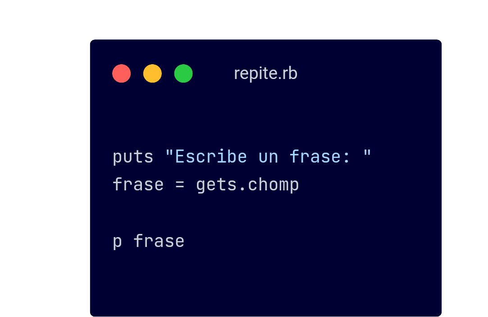

---


## saluda

Escribe un programa en la consola que le pregunte al usuario su nombre e imprima "Hola " seguido del nombre y un signo de exclamación. Por ejemplo:

````
$ ruby saluda.rb
Escribe tu nombre: Pedro

Hola Pedro!
````

## Solucion:
````
print "Escribe tu nombre: "
name = gets.chomp
puts
puts "Hola #{name}!"
````

Te en cuenta la línea en blanco antes de imprimir el saludo!

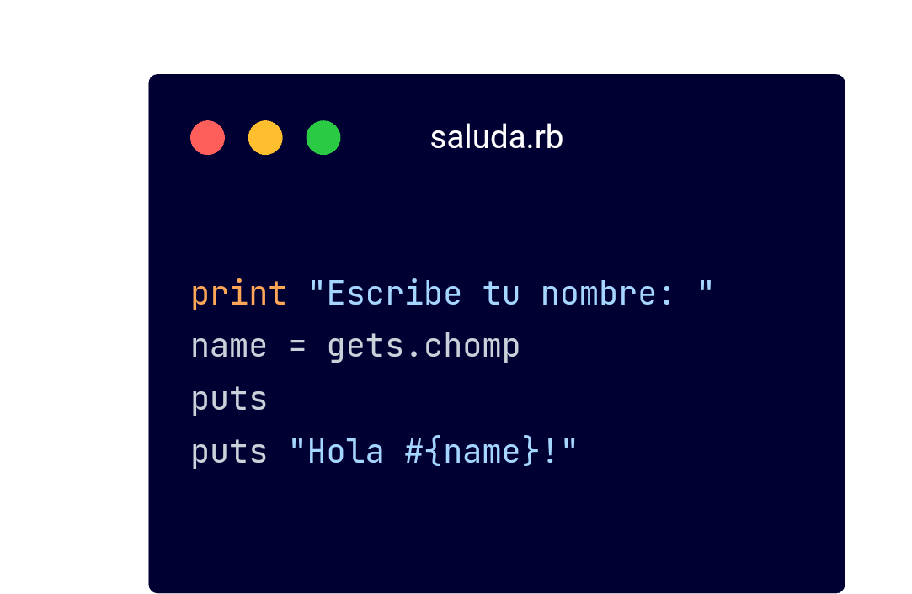

---


## suma

#### Escribe un programa para la consola que le pida al usuario ingresar dos números e imprima la suma de los dos números. Por ejemplo:

````
$ ruby suma.rb
Ingresa el primer número: 5
Ingresa el segundo número 5

El resultado es 10
````

## Solucion:
````
print 'Ingresa el primer numero: '
numberOne = gets.chomp
print 'Ingresa el segundo numero: '
numberTwo = gets.chomp

result = numberOne.to_i + numberTwo.to_i

puts
puts "El resultado es #{result}"
````
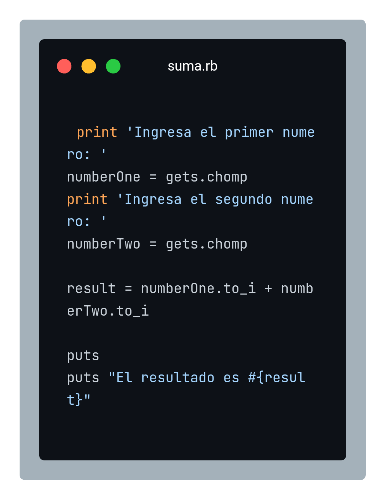

---


## ¿Cuál es mi edad?

#### Escribe un programa para la consola que le pregunte al usuario el año en que nació e imprima su edad actual. Por ejemplo, asumiendo que el año actual es 2020:

````
$ ruby edad.rb
En qué año naciste? 1990

Tienes 30 años
````

Puedes quemar el año actual en el programa aunque un buen ejercicio es buscar cómo se obtiene el año actual.

Si quieres hacer este ejercicio más interesante intenta mostrar un mensaje "Imposible! Aún no has nacido" si el año es mayor al actual e "Imposible! Nadie tiene esa edad" si la edad es más de 120 años.

También puedes tener en cuenta el caso en que la persona tenga un año, para que no utilice el plural: "Tienes 1 año" en ves de "Tienes 1 años".

## Solucion:
````
Age = Time.now.year

print 'En que año naciste: '
age = gets.chomp.to_i
ages = Age.to_i - age

if ages == 1
puts "Tienes #{ages.to_i} año"
else
puts "Tienes #{ages.to_i} años"
end

if age > Age.to_i
  puts "Imposible! Aún no has nacido"
elsif ages.to_i > 120
  puts "Imposible! Nadie tiene esa edad"
end
````

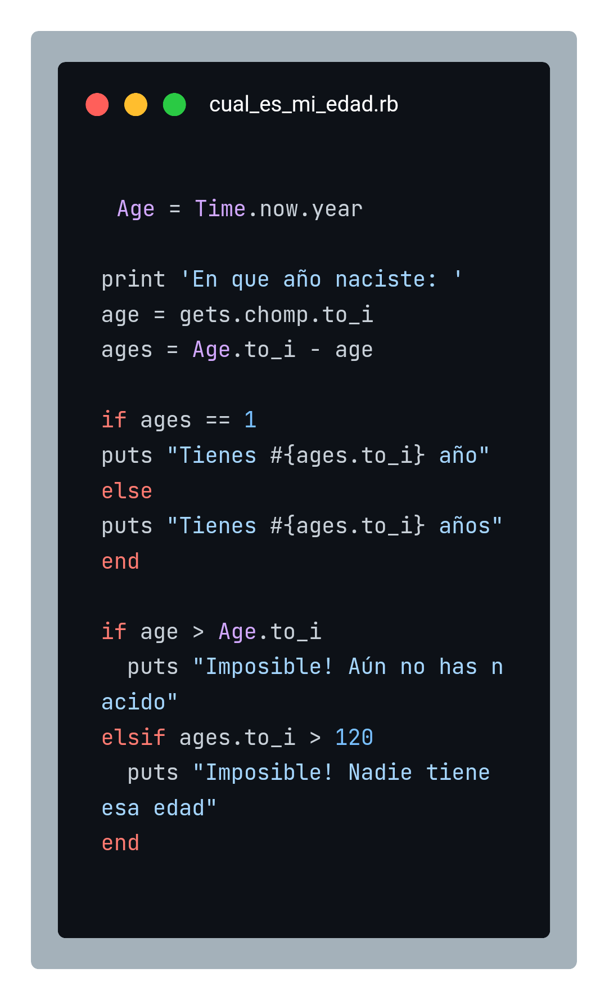

---


## BMI
El índice de masa corporal (IMC), o BMI por sus siglas en inglés, es un valor que determina la cantidad de grasa de una persona.

#### El BMI se calcula con la siguiente formula:

peso / altura^2

#### Escribe un programa que le pida al usuario su peso y su altura para calcular su BMI. Por ejemplo:

````
$ ruby bmi.rb
Ingresa tu peso: 65
Ingresa tu altura: 1.8
Tu BMI es 20.061728395061728
````
Como bono intenta redondear el número a un decimal.

## Solucion:
````
print 'Ingresa tu peso: '
peso = gets.chomp.to_f
print 'Ingresa tu altura: '
altura = gets.chomp.to_f

bmi = peso * altura**2

puts
print "Tu BMI es #{bmi.round}"
````

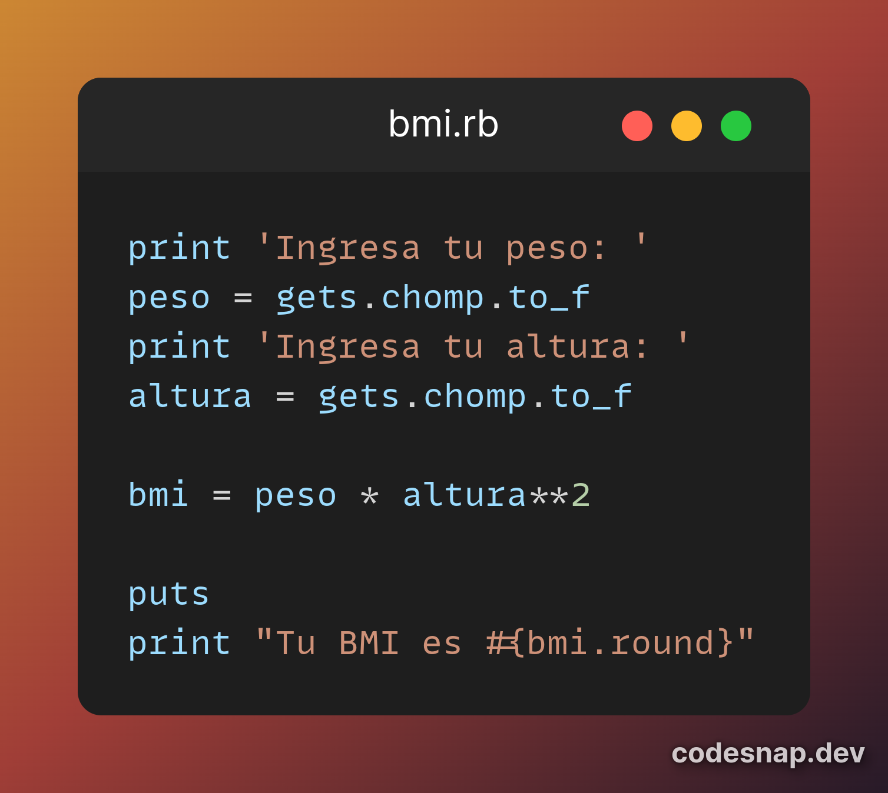

---


## Mayor que diez

#### Escribe un programa para la consola que le pida un número al usuario y le diga si es mayor o menor/igual a 10. Por ejemplo:

````
$ ruby mayor_que_diez.rb
Ingresa un número: 10
El número es mayor a 10
````

````
$ ruby mayor_que_diez.rb
Ingresa un número: 5
El número es menor o igual a 10
````

## Solucion:
````
print 'Ingresa un numero: '
numero = gets.chomp.to_i

if numero > 10
  print 'El numero es mayor a 10'
elsif numero < 10
  print 'El numero es menor que 10'
else
  print 'El numero es igual a 10'
end
````

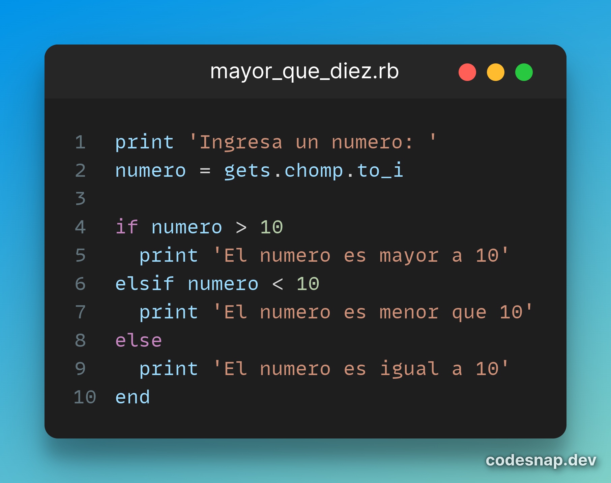

----


## Adivina el número

#### Escribe un programa que piense un número de forma aleatoria y le pida al usuario que lo trate de adivinar. Si el número es correcto debe imprimir "Felicitaciones, ese era!", de lo contrario debe imprimir "Lo siento, intenta nuevamente!". Por ejemplo:

````
$ ruby adivina.rb
Adivina el número que estoy pensando: 5
Felicitaciones, lo lograste!
````

## Solucion:
````
numero_random = rand(0..10)

print "Adivina el número que estoy pensando: "
numero_usuario = gets.chomp.to_i

puts numero_usuario == numero_random ? "Felicitaciones, ese era!" : "Lo siento, intenta nuevamente!"
````

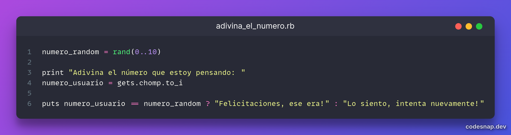

---


## Es múltiplo de 5

Un múltiplo de 5 es aquel que dividio por 5 da por resultado un número entero (sin residuo). Por ejemplo 10, 15, 20, etc. son múltiplos de 5. 11 no es múltiplo de 5 porque quedaría un residuo de 1.

#### Escribe un programa que le pida al usuario un número e imprima si es un múltiplo de 5 o no. Si es múltiplo debe imprimir "Si, el número x es múltiplo 5", de lo contrario debe imprimir "No, el número x no es múltiplo de 5". Por ejemplo:

````
ruby multiplo.md
print "Ingresa el número: 5"
Si, el número 5 es múltiplo de 5
````
````
$ ruby multiplo.md
print "Ingresa el número: 11"
No, el número 11 no es múltiplo de 5
````
#### Pista: La forma más fácil de de verificar si un número es múltiplo de otro es calcular el módulo y verificar que sea 0. El módulo es el residuo. Por ejemplo, 11 módulo 5 es 1. 23 módulo 5 es 3.

## Solucion:
````
print 'Ingrese el numero: '
numero = gets.chomp.to_i

puts numero % 5 == 0 ? "Si, el número #{numero} es múltiplo de 5" : "No, el número #{numero} no es múltiplo de 5"
````

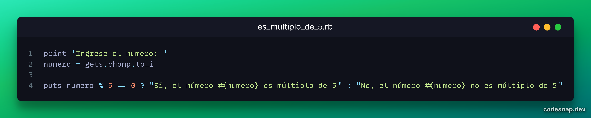

---


## Mayor, menor o igual

#### Escribe un programa para la consola que le pida un número al usuario y le diga si es mayor, menor o igual que 10. Por ejemplo:

````
$ ruby mayor_menor_igual.rb
Ingresa un número: 10
El número es igual a 10
````

````
$ ruby mayor_menor_igual.rb
Ingresa un número: 5
El número es menor que 10
````

````
$ ruby mayor_menor_igual.rb
Ingresa un número: 11
El número es mayor que 10
````

## Solucion:
````
print 'Ingresa un numero: '
numero = gets.chomp.to_i

if numero > 10
  print 'El numero es mayor que 10'
elsif numero < 10
  print 'El numero es menor que 10'
else
  print 'El numero es igual a 10'
end
````

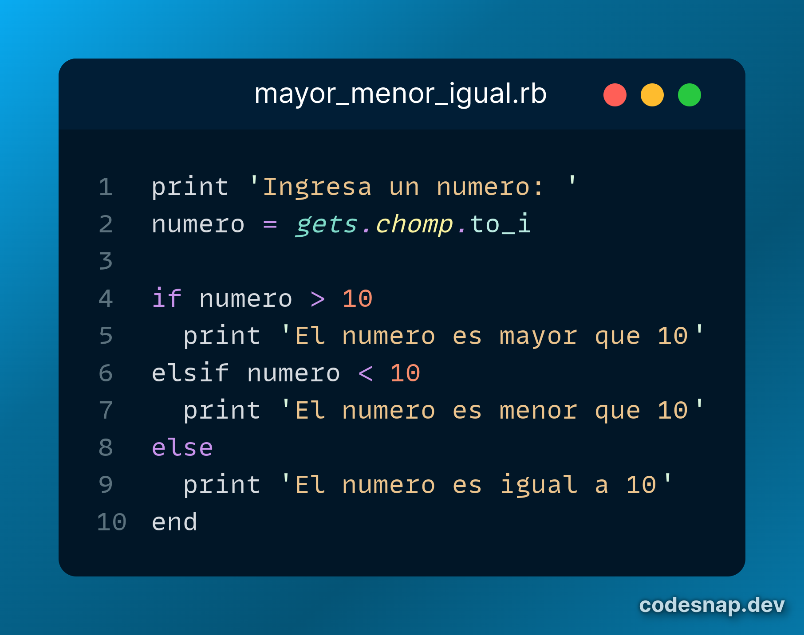

---


## BMI 2
El índice de masa corporal (IMC), o BMI por sus siglas en inglés, es un valor que determina la cantidad de grasa de una persona.

#### El BMI se calcula con la siguiente formula:

### peso / altura^2

#### Escribe un programa que le pida al usuario su peso y altura. El programa deberá calcular el BMI e imprimir: 

#### "Bajo de peso" si el BMI < 18.5

#### "Normal" si está entre 18.5 y 24.9

#### "Sobrepeso" si está entre 25 y 29.9

#### "Obeso" si es igual o mayor a 30

### Por ejemplo:

````
$ ruby bmi2.rb
Ingresa tu peso: 65
Ingresa tu altura: 1.8
Normal
````

````
$ ruby bmi2.rb
Ingresa tu peso: 65
Ingresa tu altura: 1.6
Sobrepeso
````

## Solucion:
````
print 'Ingresa tu peso: '
peso = gets.chomp.to_i
print 'Ingresa tu altura: '
altura = gets.chomp.to_f

bmi = peso * altura**2

puts

if bmi < 18.5
  puts "Bajo de peso"
elsif bmi < 25
  puts "Normal"
elsif bmi < 30
  puts "Sobrepeso"
else
  puts "Obeso"
end
````

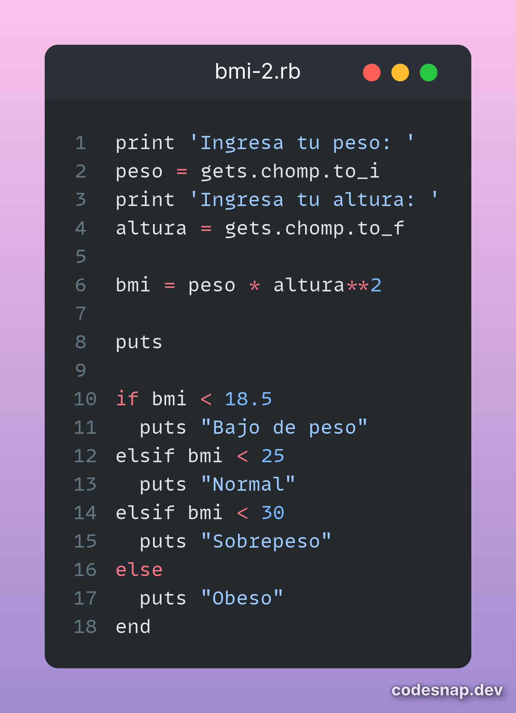

---


## Generaciones

#### Escribe un programa para la consola que le pida al usuario su año de nacimiento e imprima la generación a la que pertenece:

#### "Gran generación" si el año es menor a 1945

#### "Baby boomer" si es entre 1945 y 1964

#### "X" si es entre 1965 y 1981

#### "Millenial" si es entre 1982 y 1994

#### "Z" si es igual o mayor a 1995

### Por ejemplo:

````
$ ruby generaciones.rb

Ingresa tu año de nacimiento: 1920

Gran generación
````

````
$ ruby generaciones.rb

Ingresa tu año de nacimiento: 1945

Baby boomer
````

````
$ ruby generaciones.rb

Ingresa tu año de nacimiento: 1965

X
````

````
$ ruby generaciones.rb

Ingresa tu año de nacimiento: 1982

Millenial
````

## Solucion:
````
print 'Ingresa tu año de nacimiento: '
year = gets.chomp.to_i 

puts
if year < 1945
  puts "Gran generación"
elsif year < 1965
  puts "Baby boomer"
elsif year < 1982
  puts "X"
elsif year < 1994
  puts "Millenial"
else
  puts "Z"
end
````

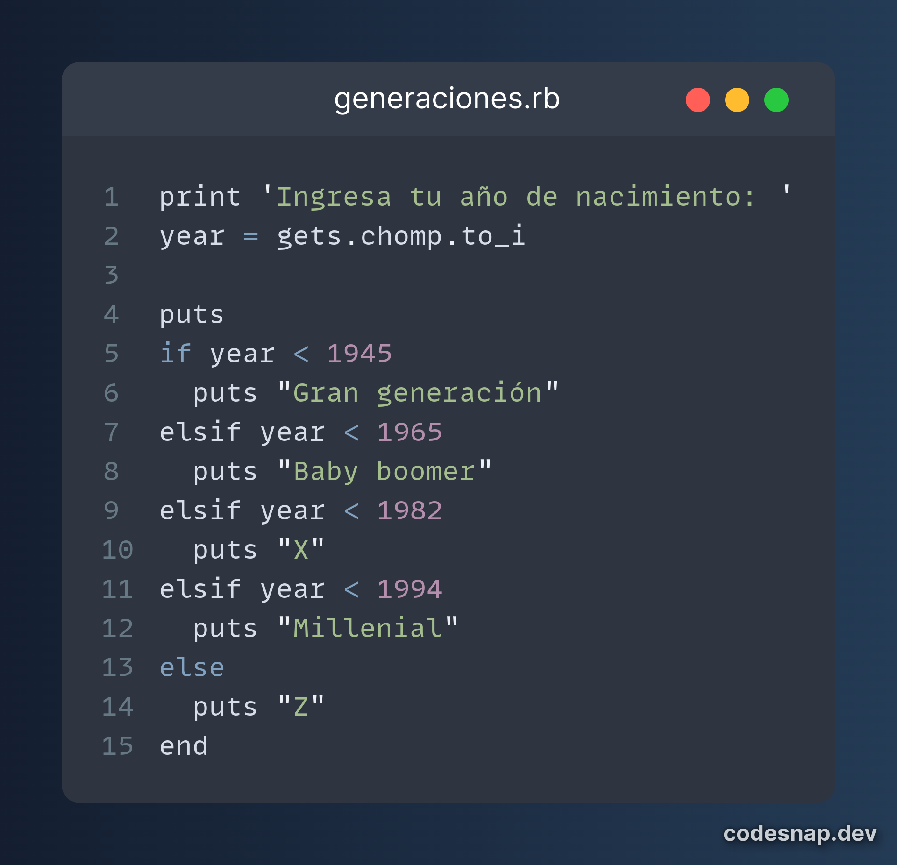

---


## Repite varias veces

#### Escribe un programa para la consola que le pida al usuario ingresar una frase y un número. El programa deberá imprimir la frase el número de veces que ingresó el usuario. Por ejemplo:

````
$ ruby repite_varias_veces.rb
Escribe una frase: Hola Mundo
Ingresa un número: 5
Hola Mundo
Hola Mundo
Hola Mundo
Hola Mundo
Hola Mundo
````

#### Nota: Si este ejercicio está muy complicado intenta primero repetir la frase un número fijo de veces (p.e. 5). Y luego intenta modificarlo para que utilice el número que ingrese el usuario.

## Soluciones:
````
print 'Escribe una frase: '
frase = gets.chomp
print 'Ingresa un numero: '
numero = gets.chomp.to_i

numero.times do
  puts frase
end 
````

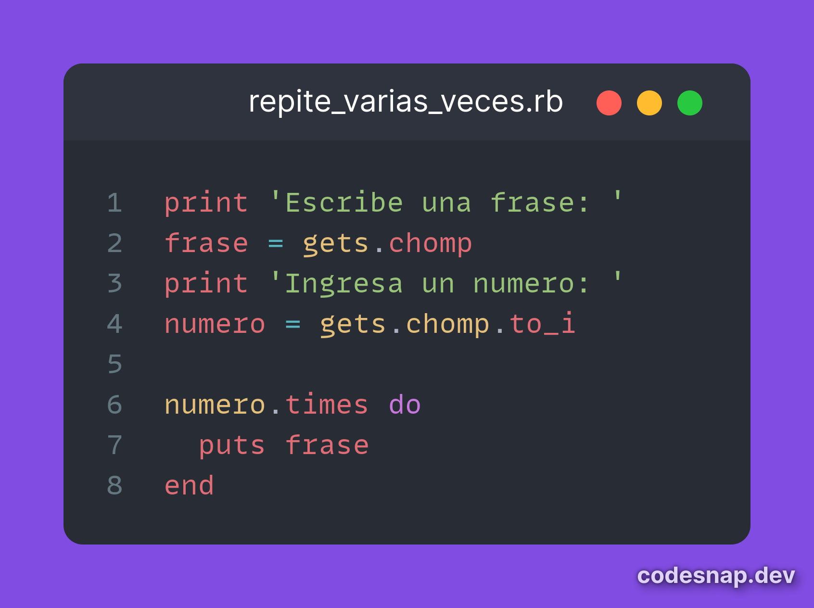

---


## Rango de números

#### Escribe un programa para la consola que le pida al usuario dos números e imprima los números en ese rango. Por ejemplo:

````
$ ruby rango_numeros.rb
Ingresa el límite inferior: 5
Ingresa el límite superior: 10
5
6
7
8
9
10
````

#### Nota: Fíjate que se imprimen también los números en los límites, en el ejemplo el 5 y el 10.

Si este ejercicio te está pareciendo muy difícil intenta primero pedir sólo un número e imprimir del 0 hasta ese número. ¿Qué tal del 1 hasta ese número?

## Solucion:
````
print 'Ingresa el limite inferior: '
num1 = gets.chomp.to_i
print 'Ingresa el limite superior: '
num2 = gets.chomp.to_i

(num1..num2).each do |n| 
  puts n
end
````

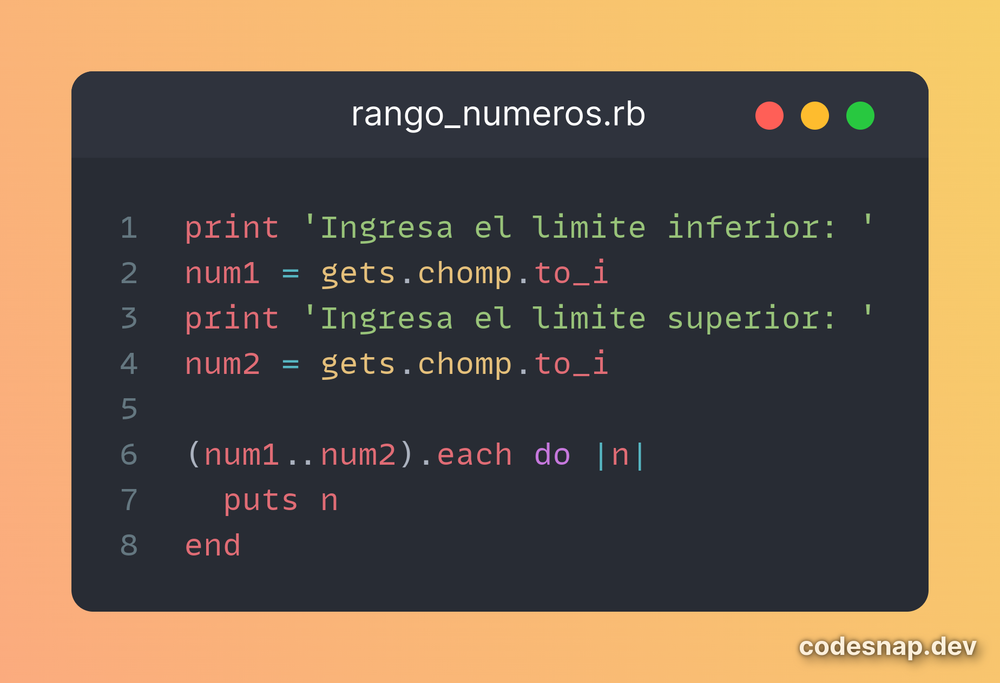

---


## Adivina el número (varios intentos)

#### Escribe un programa que piense un número de forma aleatoria y le pida al usuario que lo trate de adivinar (como en uno de los ejercicios anteriores). La diferencia es que esta vez el usuario puede intentar indefinidamente hasta que encuentre el número. Por ejemplo:

````
$ ruby adivina_intentos.rb
Adivina el número que estoy pensando: 4
Lo sentimos! Intenta nuevamente: 5
Lo sentimos! Intenta nuevamente: 7

Felicitaciones, lo encontraste!
````

Si deseas ir un paso más allá intenta limitar el número de intentos a 3 o 5 :)

## Solucion:
````
numero_random = rand(0..10)

print "Adivina el número que estoy pensando: "
numero_usuario = gets.chomp.to_i

puts numero_usuario == numero_random ? "Felicitaciones, ese era!" : "Lo siento, intenta nuevamente!"

while numero_usuario != numero_random
  print "Adivina el número que estoy pensando: "
numero_usuario = gets.chomp.to_i

puts numero_usuario == numero_random ? "Felicitaciones, ese era!" : "Lo siento, intenta nuevamente!"
end
````

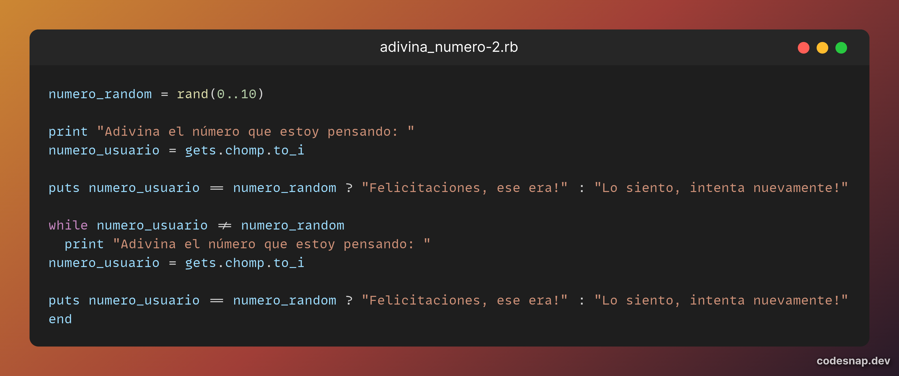

---


## Imprime la lista

Escribe un programa para la línea de comandos que le permita a un usuario ingresar una lista de nombres y después los imprima mostrando la posición en la que se encuentran.

Lo primero que debe pedir el programa es el número de personas que se quieren ingresar. Luego pregunta por el nombre de cada persona y las va almacenando en un arreglo. Al final, por cada persona ingresada, imprime la frase "El nombre en la posición x es y" (p.e. "El nombre en la posición 0 es Pedro").

````
$ ruby imprime_lista.rb
Ingresa el número de personas: 3
Persona 1: Juan
Persona 2: Pedro
Persona 3: Daniel

El nombre en la posición 0 es Juan
El nombre en la posición 1 es Pedro
El nombre en la posición 2 es Daniel
````

Si se te está complicando este ejercicio intenta inciar con un arreglo fijo. 
### Por ejemplo:

````
names = ["Juan", "Pedro", "Daniel"]
````

recorre el arreglo e imprime la frase por cada uno

Puedes también imprimir sólo el nombre y después vas armando la frase. La programación es de dividir los problemas e irlos solucionando por partes.

## Solucion:
````
print "Ingresa el número de personas: "
num = gets.chomp.to_i

people = []

num.times do |n_people|
  print "Persona #{n_people+1}: "
  people << gets.chomp
end

puts

people.each_with_index do |names, index|
  puts "El nombre en la posición #{index} es #{names}"
end
````

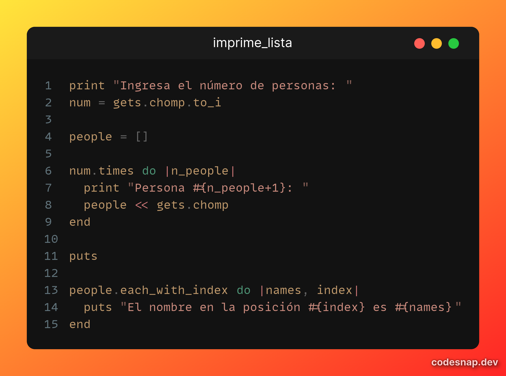

---


## Escalera

#### Escribe un programa para la consola que le pida al usuario un número y cree una escalera como en el siguiente ejemplo:

````
Ingresa un número: 5
#
##
###
####
#####
````

En la primera línea se imprime un #, en la segunda dos, y así sucesivamente hasta el número que ingresó el usuario.

#### Si el ejercicio te parece muy fácil intenta invertir la escalera:

````
Ingresa un número: 5
#####
####
###
##
#
````

## Solucion:
````
print 'Ingrese un numero: '
num = gets.chomp.to_i

caracter = '#'

(1..num).each do |i|
  puts caracter * i
end
````

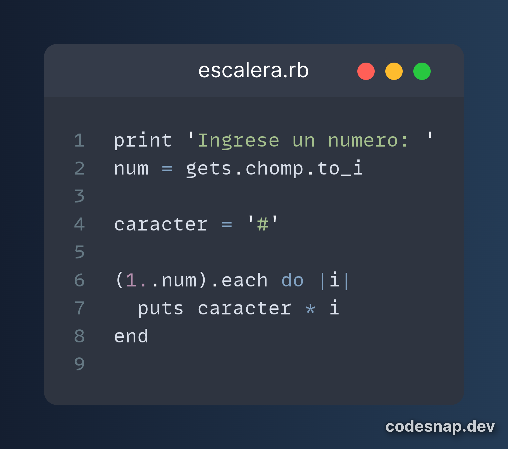

---


## Orden aleatorio

Escribe un programa que permita al usuario ingresar una lista de nombres y los mezcle de forma aleatoria.

El programa deberá preguntar primero cuál es el número de personas que se quiere ingresar. Luego le va preguntando por el nombre de cada persona y las va almacenando en un arreglo. Al final muestra la lista de personas ordenadas de forma aleatoria. 

#### Por ejemplo:

````
Ingresa el número de personas: 3
Persona 1: Juan
Persona 2: Pedro
Persona 3: Daniel

["Pedro", "Juan", "Daniel"]
````

Para mostrar el arreglo después de mezclarlo puedes utilizar .inspect. 

#### Por ejemplo:

````
arr = ["Pedro", "Juan", "Daniel"]
puts arr.inspect # imprime ["Pedro", "Juan", "Daniel"]
````

Si este ejercicio te está pareciendo muy complicado intenta primero pedirle al usuario un número fijo de personas e imprimirlas (sin mezclar). Para solucionar este ejercicio debes definir una variable con un arreglo vacío y después hacer un ciclo en el que vas insertando cada nombre que ingrese el usuario.

## Solucion:
````
print "Ingresa el número de personas: "
num = gets.chomp.to_i

people = []

num.times do |n_people|
  print "Persona #{n_people+1}: "
  people << gets.chomp
end

puts

array_random = people.shuffle

puts array_random.inspect
````

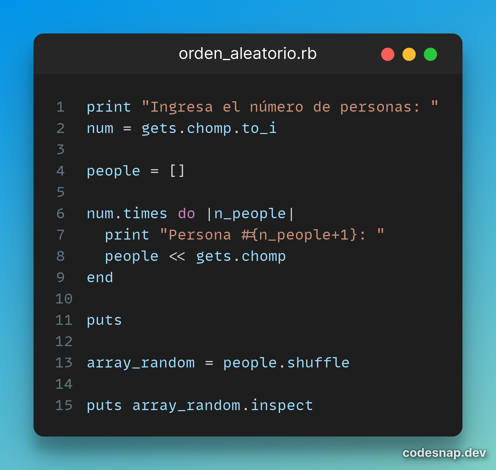

---


## Traductor

Escribe un programa que traduzca los números del uno al diez de español a inglés. Si es cualquier otra palabra deberá imprimir "No encontramos la traducción de " seguido de la palabra que escribió el usuario. 

#### Por ejemplo:

````
$ ruby traductor.rb
Escribe la palabra a traducir: uno

La traducción es: one
````

````
$ ruby
Escribe la palabra a traducir: hola

No encontramos la traducción de hola
````

Aunque este ejercicio se puede solucionar utilizando condicionales, intenta definir un hash con las traducciones (la llave sería la palabra en español y el valor la palabra en inglés) y utilizar ese hash para traducir la palabra que ingrese el usuario.

## Solucion:
````
hash = {
  uno: 'one', 
  dos: 'two', 
  tres: 'three', 
  cuatro: 'four', 
  cinco: 'five', 
  seis: 'six', 
  siete: 'sevent', 
  ocho: 'eight', 
  nueve: 'nine', 
  dies: 'ten'
}

print 'Escribe la palabra a traducir: '
palabra = gets.chomp.to_sym

traducir = hash[palabra]
puts
if traducir
  puts "La traducción es: #{traducir}"
else
  puts "No encontramos la traducción de #{palabra}"
end
````

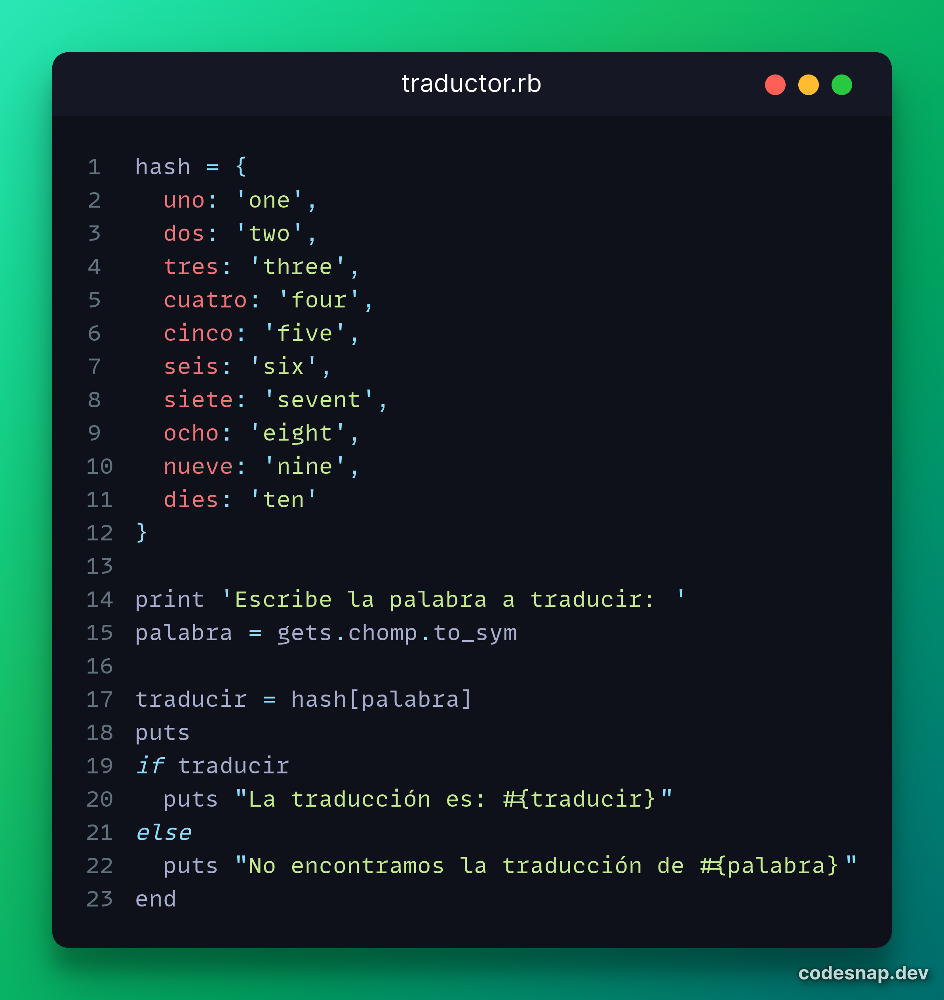

---


Métodos
Escribe un método llamado `hola` que reciba un argumento y retorne una cadena de texto "Hola " seguido del argumento que se recibió. Puedes copiar y pegar la siguiente plantilla para escribir tu solución:

````
# escribe tu solución acá

puts hola("Pedro") # debería imprimir "Hola Pedro"
puts hola("Juan") # debería imprimir "Hola Juan"
puts hola("") # debería imprimir "Hola "
````

#### Al ejecutarlo debería aparecer algo así:

````
$ ruby metodos.rb
Hola Pedro
Hola Juan
Hola
````

## Solucion:
````
def hola(name)
  puts "hola #{name}"
end

print hola("Pedro") 
print hola("Juan")
print hola("")
````

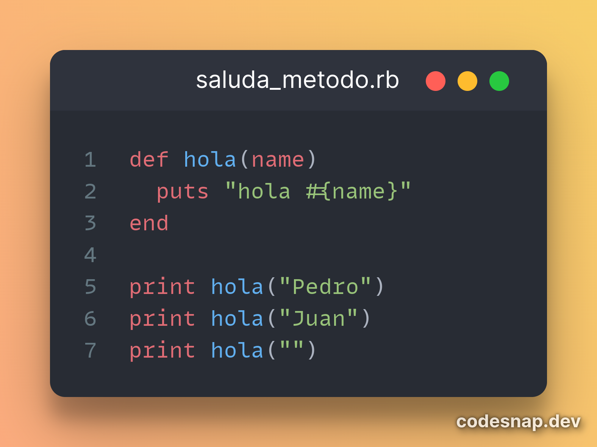

---


## Todos son 5

Escribe un método llamado `todos_son_5` que reciba un arreglo y devuelva true si todos los elementos son el número 5. Si hay al menos un elemento que no es 5 deberá retornar false.

#### Puedes utilizar la siguiente plantilla para tu solución:

````
# acá va tu solución

puts todos_son_5([5, 5, 5]) # true
puts todos_son_5([5, 5, 5, 5, 5, 5]) # true
puts todos_son_5([5, 4, 5]) # false
puts todos_son_5([]) # false
puts todos_son_5([5, "5", 5]) # false
````

#### Al ejecutarlo debería aparecer lo siguiente:

````
$ ruby todos_son_5.rb
true
true
false
false
false
````

## Solucion:
````
def todos_son_5(array)
  return false if array.length == 0 
  
  array.each do |e|
    return false if e != 5
  end
  
  true
end

puts todos_son_5([5, 5, 5])
puts todos_son_5([5, 5, 5, 5, 5, 5])
puts todos_son_5([5, 4, 5])
puts todos_son_5([])
puts todos_son_5([5, "5", 5]) 
````

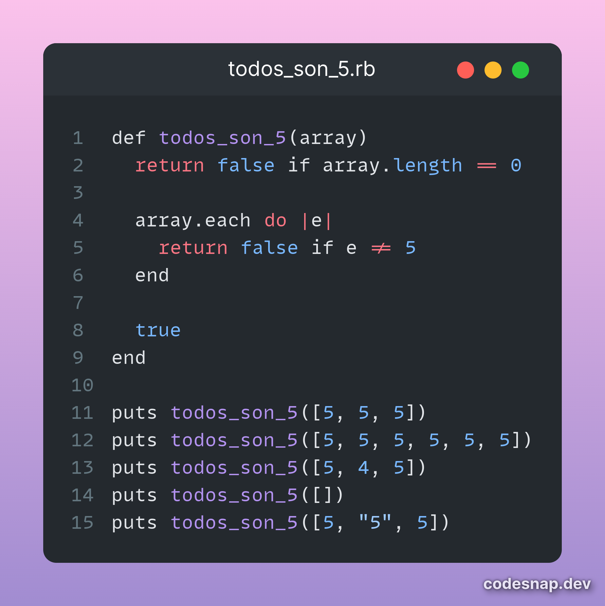

---

## NIVEL-2

---


## Número de likes

Escribe un método llamado `numero_de_likes` que reciba un número y devuelva una cadena utilizando el formato de K para miles y M para millones (p.e. 1400 se convierte en 1K, 34,567 se convierte en 34K, 7'456,345 se convierte en 7M). Si el número es menor a 1000 se debe devolver el mismo número como una cadena.

````
# escribe tu solución acá

puts numero_de_likes(778) # "778"
puts numero_de_likes(1000) # "1K"
puts numero_de_likes(1999) # "1K"
puts numero_de_likes(34_567) # "34K"
puts numero_de_likes(999_999) # "999K"
puts numero_de_likes(7_456_345) # "7M"
````

Una mejora que se podría investigar es utilizar un decimal, de esa forma 1999 sería "1.9K" y 7'456,345 sería "7.4M". Ten en cuenta que siempre debería redondear hacia abajo.

## Solucion:
````
def numero_de_likes(num)
  if num < 1000
    "#{num}"
  elsif num < 1_000_000
    "#{(num / 1000.to_f).floor(1)}K"
  else
    "#{(num / 1_000_000.to_f).floor(1)}M"
  end
end

puts

puts numero_de_likes(778) # "778"
puts numero_de_likes(1000) # "1K"
puts numero_de_likes(1999) # "1K"
puts numero_de_likes(34_567) # "34K"
puts numero_de_likes(999_999) # "999K"
puts numero_de_likes(7_456_345) # "7M"

puts
````

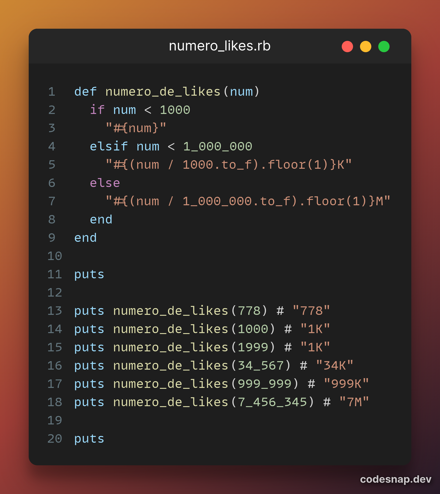

---


## Contar elementos

Escribe un método `contar` que reciba un arreglo y retorne la cantidad de veces que aparece el número 5.

````
# escribe tu solución acá

puts contar([1, 5, 5, 1]) # 2
puts contar([2, 6, "5"]) # 0
puts contar([]) # 0
````

##### Si quieres agregarle más dificultad modifica el método para que reciba un argumento adicional y retorne la cantidad de veces que aparece ese argumento en el arreglo:

````
# escribe tu solución acá

puts contar([1, 5, 5, 1], 5) # 2
puts contar([2, 6, "5"], "5") # 1
puts contar([1, "hola", 3, "mundo"], 5) # 0
````

## Solucion:
````
def contar(arr)
  array = arr.count(5)
  array.to_i
end

puts contar([1, 5, 5, 1]) # 2
puts contar([2, 6, "5"]) # 0
puts contar([]) # 0

puts

# Argumento adicional
def contar(arr, elemento)
  array = arr.count(elemento)
  array.to_i
end

puts contar([1, 5, 5, 1], 5) # 2
puts contar([2, 6, "5"], "5") # 1
puts contar([1, "hola", 3, "mundo"], 5) # 0
````


---


## Reemplazar elementos

Escribe un método llamado `reemplazar` que reciba un arreglo y reemplace todos los elementos que sean un 1 por un 0 y lo contrario, todos los elementos que sean 0 por 1.

````
# escribe tu solución acá

puts reemplazar([1, 1]).inspect # [0, 0]
puts reemplazar([0, 0]).inspect # [1, 1]
puts reemplazar([1, 0, 0, 1]).inspect # [0, 1, 1, 0]
puts reemplazar([1, 0, 2]).inspect # [0, 1, 2]
````

## solucion:
````
def reemplazar(arr)
  arr.map { |elemento| elemento == 1 ? 0 : (elemento == 0 ? 1 : elemento) }
end

puts reemplazar([1, 1]).inspect # [0, 0]
puts reemplazar([0, 0]).inspect # [1, 1]
puts reemplazar([1, 0, 0, 1]).inspect # [0, 1, 1, 0]
puts reemplazar([1, 0, 2]).inspect # [0, 1, 2]
````

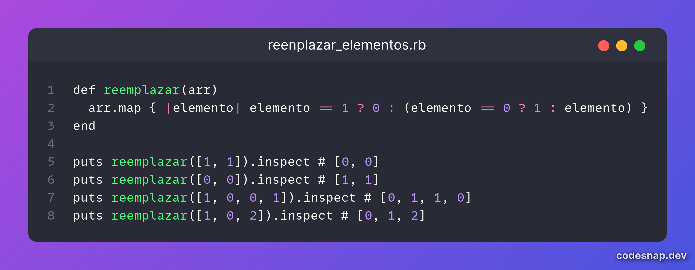

---


## Posiciones pares

Escribe un método llamado `posiciones_pares` que reciba un arreglo y devuelva un nuevo arreglo con los valores que se encuentran en las posiciones pares del arreglo (0, 2, 4, 6, 8, etc.)

````
# escribe tu solución acá

puts posiciones_pares([0, 1, 2, 3, 4]).inspect # [0, 2, 4]
puts posiciones_pares(["Make", "sun", "it", "bright", "Real"]).inspect # ["Make", "it", "Real"]
puts posiciones_pares([]).inspect # []
````

## Soluciones:
````
def posiciones_pares(arr)
  arr.select.with_index { |element, index| index.even? }
end

puts posiciones_pares([0, 1, 2, 3, 4]).inspect # Output: [0, 2, 4]
puts posiciones_pares(["Make", "sun", "it", "bright", "Real"]).inspect # Output: ["Make", "it", "Real"]
puts posiciones_pares([]).inspect # Output: []
````

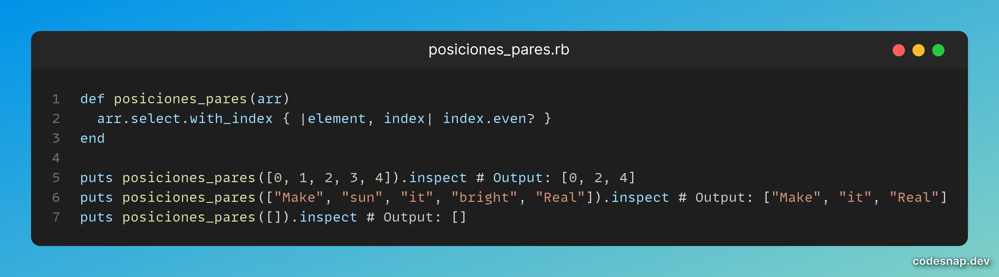

---


## Números pares

Escribe un método llamado `numeros_pares` que reciba un arreglo de números y devuelva un nuevo arreglo únicamente con los números pares.

````
# escribe tu solución acá

puts numeros_pares([0, 1, 2, 3, 4]).inspect # [0, 2, 4]
puts numeros_pares([120, 876, 934, 1298]).inspect # [120, 876, 934, 1298]
puts numeros_pares([7, 921, 43, 9649]).inspect # []
puts numeros_pares([17, 34, 87, 6, 95, 82, 21]).inspect # [34, 6, 82]
puts numeros_pares([]).inspect # []
````

## Soluciones:
````
def numeros_pares(arr)
  result = []
  arr.each do |num|
    result << num if num.even?
  end
  result
end


puts numeros_pares([0, 1, 2, 3, 4]).inspect # [0, 2, 4]
puts numeros_pares([120, 876, 934, 1298]).inspect # [120, 876, 934, 1298]
puts numeros_pares([7, 921, 43, 9649]).inspect # []
puts numeros_pares([17, 34, 87, 6, 95, 82, 21]).inspect # [34, 6, 82]
puts numeros_pares([]).inspect # []
````

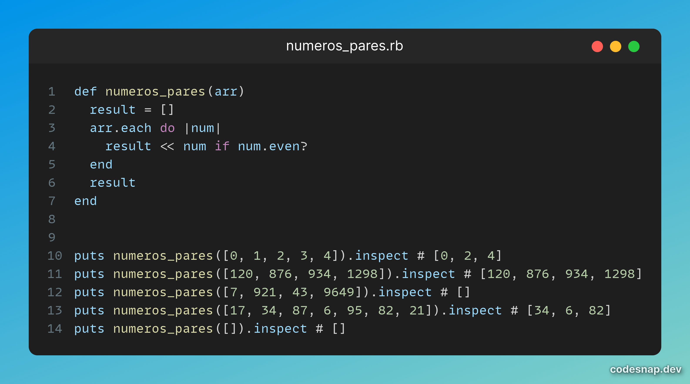

---


## Arreglo de posiciones

Escribe un método llamado `posiciones_num_1` que reciba un arreglo y retorne un nuevo arreglo con las posiciones en las que aparece el número uno (1).

#### Puedes utilizar la siguiente plantilla

````
# escribe tu solución acá

puts posiciones_num_1([0, 1, 0, 1]).inspect # [1, 3]
puts posiciones_num_1([1, 1, 1]).inspect # [0, 1, 2]
puts posiciones_num_1([2, 3, 4]).inspect # []
````

## Soluciones:
````
def posiciones_num_1(arr)
  ret = []
  arr.each_with_index do |val, i|
    ret << i if val == 1
  end
  ret
end

puts posiciones_num_1([0, 1, 0, 1]).inspect # [1, 3]
puts posiciones_num_1([1, 1, 1]).inspect # [0, 1, 2]
puts posiciones_num_1([2, 3, 4]).inspect # []
````

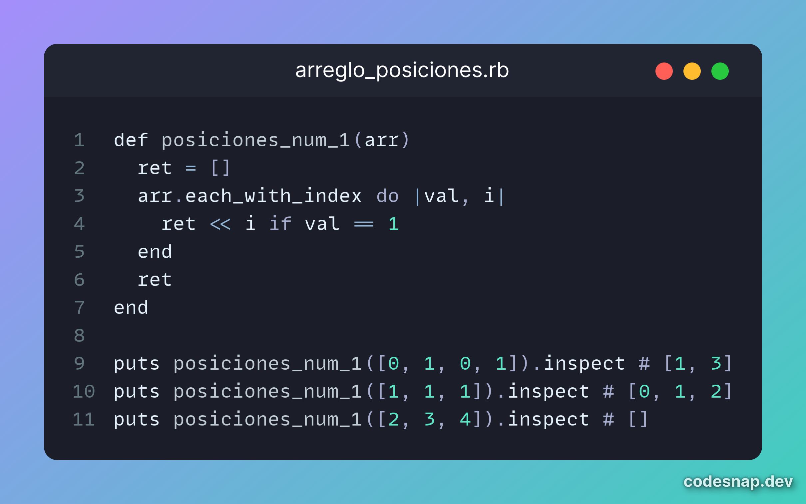

---


## Promedio

Escribe un método llamado `promedio` que reciba un arreglo de números y retorne el promedio de los números en el arreglo.

````
# escribe tu solución acá

puts promedio([3, 3, 3]) # 3
puts promedio([3, 4, 5, 8]) # 5
puts promedio([2, 2, 3, 3]) # 2.5
````

## Solucion:
````
def promedio(arr)

  arr.sum / arr.length.to_f

end

puts promedio([3, 3, 3]) # 3
puts promedio([3, 4, 5, 8]) # 5
puts promedio([2, 2, 3, 3]) # 2.5
````

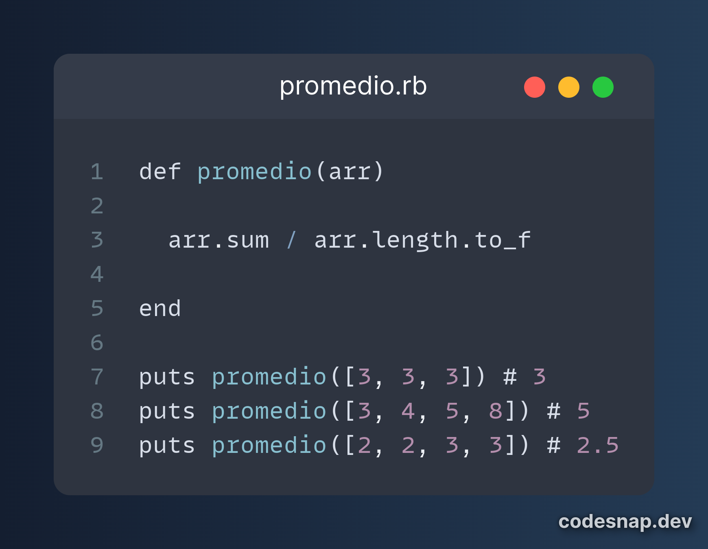

---


## Generador de contraseñas

#### Escribe un método llamado `contrasena` que reciba una cadena y devuelva una nueva cadena realizando los siguientes cambios:


Las mayúsculas se reemplazan por minúsculas.
Se eliminan los espacios en blanco.
Se reemplaza la a por 4.
Se reemplaza la e por 3.
Se reemplaza la i por 1.
Se reemplaza la o por 0.

````
# escribe tu solución acá

puts contrasena("hola") # "h0l4"
puts contrasena("esta es una prueba") # "3st43sun4pru3b4"
puts contrasena("") # ""
````

#### Nota: Esta no es una forma segura de generar contraseñas y no la recomendamos.

## Solucion:
````
def contrasena(str)

  str = str.downcase
  str = str.gsub  " ", ""
  str = str.gsub  "a", "4"
  str = str.gsub  "e", "3"
  str = str.gsub  "i", "1"
  str = str.gsub  "o", "0"

  str
end

puts contrasena("hola") # "h0l4"
puts contrasena("esta es una prueba") # "3st43sun4pru3b4"
puts contrasena("") # ""
````

````
def contrasena(str)
  
  subs = {'a' => '4', 'e' => '3', 'i' => '1', 'o' => '0'}
  str.downcase.gsub(/[aeio]/, subs).delete(' ')
  
end

puts contrasena("hola") # "h0l4"
puts contrasena("esta es una prueba") # "3st43sun4pru3b4"
puts contrasena("") # ""
````

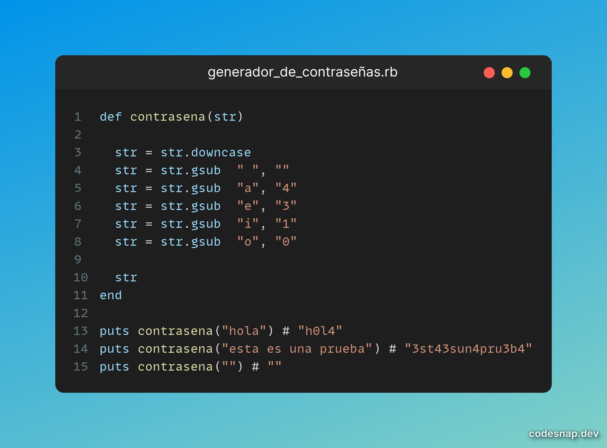
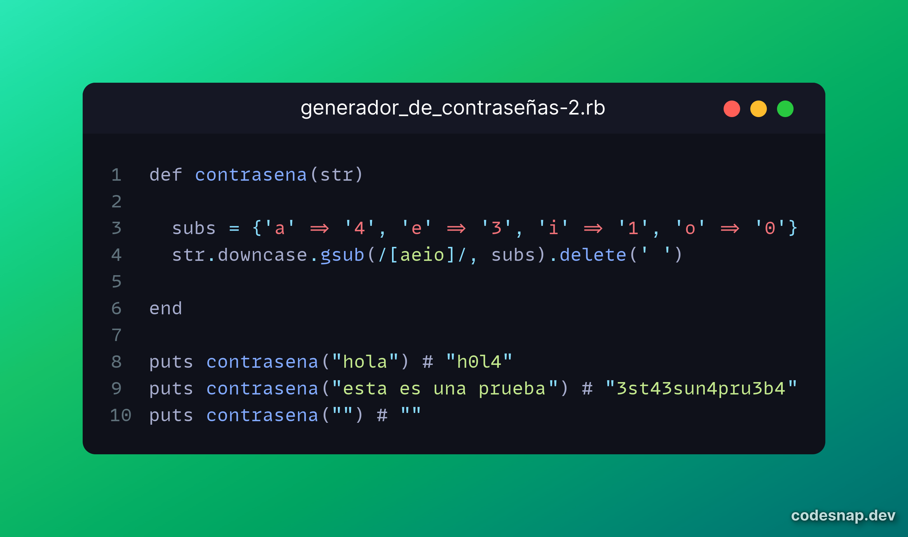

---


## Buscar en arreglo

#### Escribe un método llamado 'buscar' que reciba dos parámetros: 

arreglo y otro parámetro (de cualquier tipo), y retorne la primera posición en la que se encuentra el segundo parámetro en el arreglo. Si no se encuentra debe retornar -1.

Por ejemplo, en el arreglo [1, 2, 3] el número 3 se encuentra en la posición 2, que es lo que retornaría el método. Si el arreglo es nuevamente [1, 2, 3] pero el segundo parámetro es 5 retornaría -1.

````
# escribe tu solución acá

puts buscar([1, 2, 3], 3) # 2
puts buscar([4, 7, 2, 9, 3], 4) # 0
puts buscar([8, 3, 54, 9, 1], 7) # -1
puts buscar([3, 1, 4, 2, 4], 4) # 2
puts buscar(["h", "o", "l", "a"], "l") # 2
puts buscar(["h", "o", "l", "a"], "d") # -1
````

## Solucion:
````
def buscar(arr, elemento)
  indice = arr.index(elemento)

  if indice.nil?
    print -1
  else
    print indice
  end
end


puts buscar([1, 2, 3], 3) # 2
puts buscar([4, 7, 2, 9, 3], 4) # 0
puts buscar([8, 3, 54, 9, 1], 7) # -1
puts buscar([3, 1, 4, 2, 4], 4) # 2
puts buscar(["h", "o", "l", "a"], "l") # 2
puts buscar(["h", "o", "l", "a"], "d") # -1
````

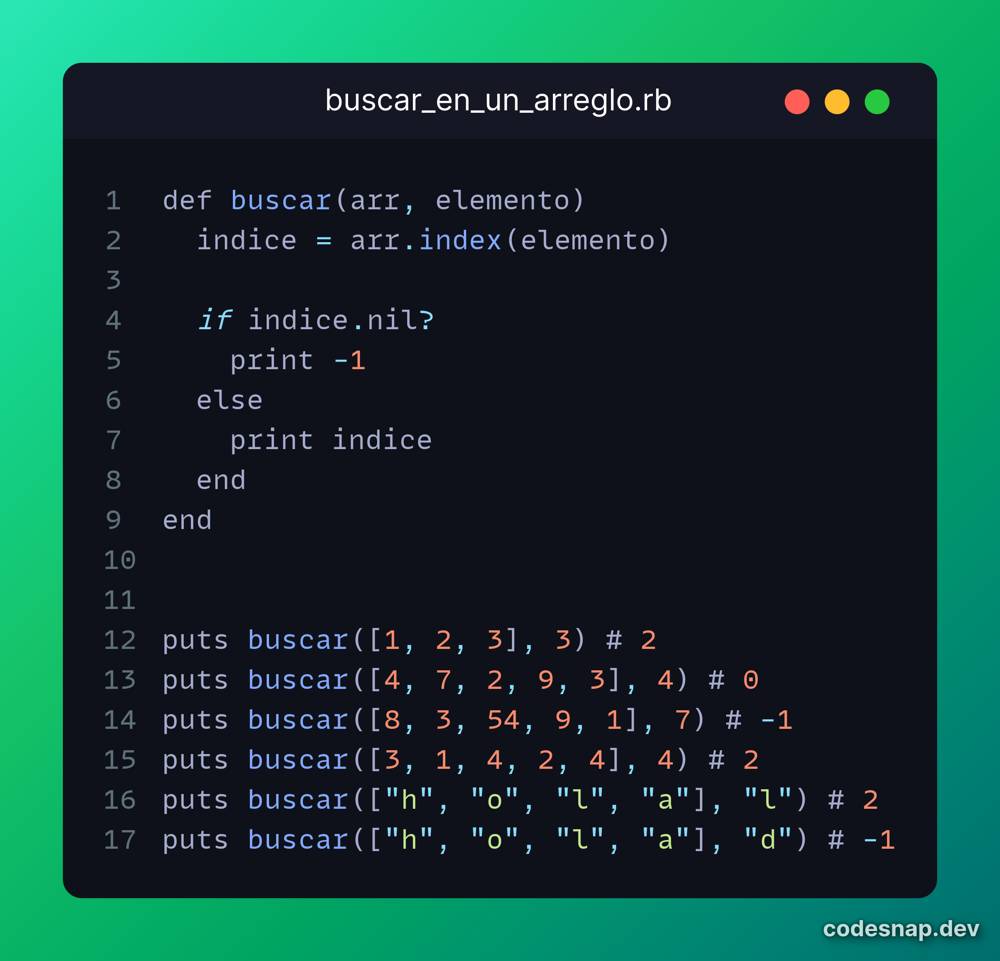

---


## Cadena a arreglo

Escribe un método llamado `cadena_a_arreglo` que reciba una cadena de texto y retorne un arreglo con las palabras de la cadena.
Puedes dividir las cadena por los espacios en blanco para encontrar las palabras.

````
# escribe tu solución acá

puts cadena_a_arreglo("Hola mundo").inspect # ["Hola", "mundo"]
puts cadena_a_arreglo("Make it Real").inspect # ["Make", "it", "Real"]
puts cadena_a_arreglo("").inspect # []
````

#### Nota: Ruby trae un método sobre las cadenas que te permite hacer precisamente esto. Tu reto es encontrar ese método y aplicarlo.

Si quieres ir un paso más allá intenta separar la cadena sin utilizar ese método.

## Solucion:
````
def cadena_a_arreglo(str)
  str.split(" ")
end


puts cadena_a_arreglo("Hola mundo").inspect # ["Hola", "mundo"]
puts cadena_a_arreglo("Make it Real").inspect # ["Make", "it", "Real"]
puts cadena_a_arreglo("").inspect # []
````

````
def cadena_a_arreglo(str)
  arr = []
  pal = ""
  str.each_char do |i|
    if i == " "
      arr << pal
      pal = ""
    else
      pal += i
    end
  end
  arr << pal
end


puts cadena_a_arreglo("Hola mundo").inspect # ["Hola", "mundo"]
puts cadena_a_arreglo("Make it Real").inspect # ["Make", "it", "Real"]
puts cadena_a_arreglo("").inspect # []
````

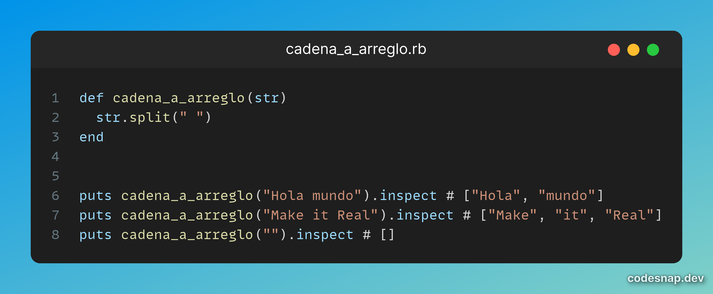
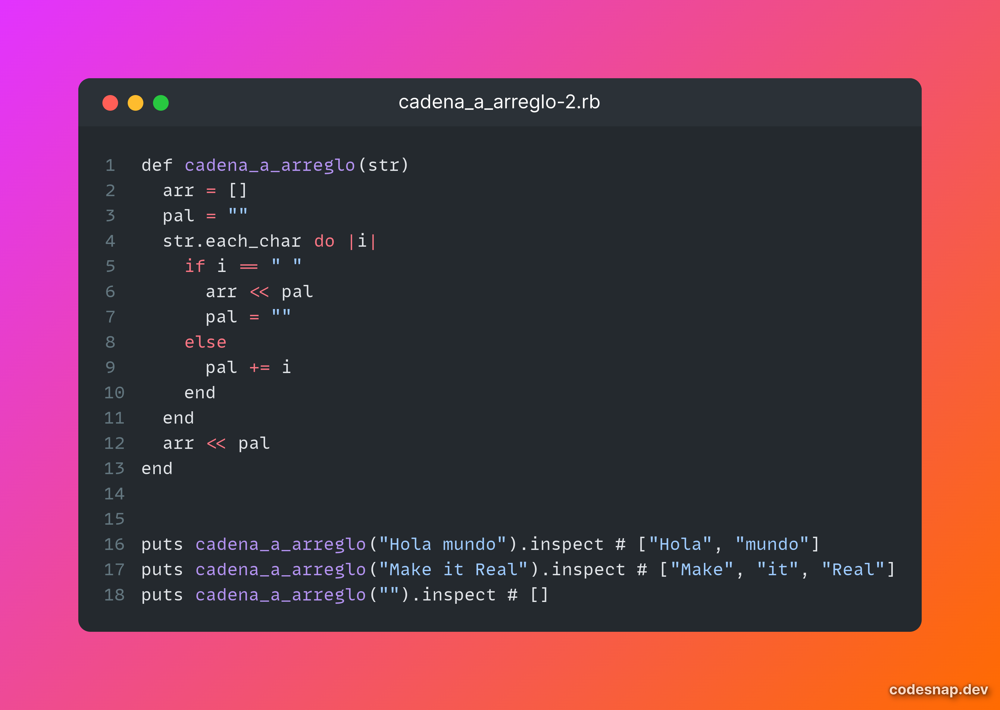

---


## Arreglo a cadena

Escribe un método llamado `arreglo_a_cadena` que reciba un arreglo y retorne una cadena de texto uniendo todos los elementos con espacios.

````
# escribe tu solución acá

puts arreglo_a_cadena(["hola", "mundo"]) # "hola mundo"
puts arreglo_a_cadena(["Make", "it", "Real"]) # "Make it Real"
puts arreglo_a_cadena([]) # ""
````

#### Nota: Ruby trae un método sobre los arreglos que te permite hacer precisamente esto. 
#### Tu reto es encontrar ese método y aplicarlo.

Si quieres ir un paso más allá intenta separar la cadena sin utilizar ese método.

## Solucion:
````
def arreglo_a_cadena(arr)
  arr.join(" ")
end


puts arreglo_a_cadena(["hola", "mundo"]) # "hola mundo"
puts arreglo_a_cadena(["Make", "it", "Real"]) # "Make it Real"
puts arreglo_a_cadena([]) # ""
````

````
def arreglo_a_cadena(arr)
  cadena = ""
  separador = " "
  arr.each do |elemento|
    cadena += elemento.to_s + separador
  end
  cadena = cadena.chomp(separador)

  print cadena
end


puts arreglo_a_cadena(["hola", "mundo"]) # "hola mundo"
puts arreglo_a_cadena(["Make", "it", "Real"]) # "Make it Real"
puts arreglo_a_cadena([]) # ""
````

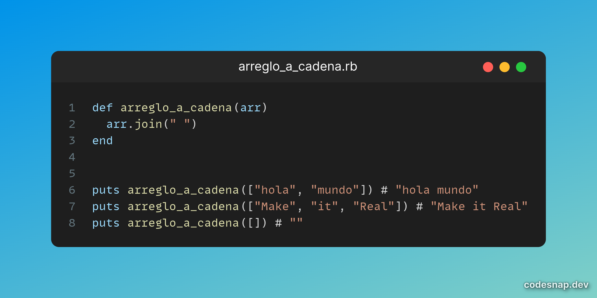
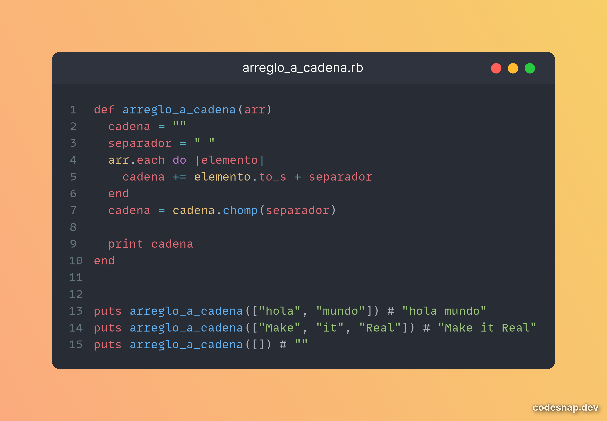

---


## Buscar en una matriz

Escribe un método llamado buscar que reciba dos argumentos: una matriz (un arreglo de arreglos) y otro argumento (de cualquier tipo). El método debe retornar un arreglo con la posición donde se encuentra el segundo argumento. Si no se encuentra debe retornar nil.

#### Por ejemplo, en el siguiente arreglo:

````
[
["s", "o", "l"],
["b", "i", "n"]
]
````

#### El elemento s se encuentra en la posición [0, 0]. El elemento n se encuenta en [1, 2].

````
# escribe tu solución acá

buscar([[1, 2], [3, 4]], 3) # [1, 0]
buscar([[1, 2], [3, 4]], 5) # nil
````

## Solucion:
````

````


---


Buscar en una matriz
Matriz a tabla
Crea un hash
Traduce la frase
Formatea un hash
Frecuencias
Transcripción de ARN


## NIVEL-3 